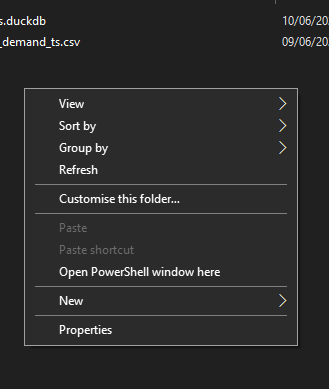

## Windows installation (DuckDB Desktop tooling)

-   You will have a powerfull tool in your CMD/powershell. No need to run R or Python.
-   We will use winget which is an official Microsoft tool (Windows Package Manager). It is **safe** since it pulls packages from the Microsoft Community Package Manifest Repository. This Microsoft resource has a review process to ensure packages are safe and legitimate.
-   Open a cmd or Powershell (windows) and run the following command: `winget install DuckDB.cli --version 1.4.4`
-   If you already have another DuckDb version you should uninstall it using this command: `winget uninstall DuckDB.cli`. You may need to reinstall the extensions after upgrading.
-   There is a file .duckdbrc in this repository which you need to copy in your user folder (C:\Users\your_user_name). This file contains the proxy configuration for duckdb. If you don't copy this file, you won't be able to install extensions and use the user interface.

-   Then, you can start using duckdb, you need to run the command in a cmd/porwershell: `duckdb`
-   You can use the following command to check your installed extension: `SELECT extension_name, installed, description FROM duckdb_extensions();`

-   You can exit duckdb using .exit or simply closing the window

### Extensions

-   If you only read csv files, it is not mandatory to install the other extensions. So, you can skip these extensions installation.
-   If you already executed duckdb in your terminal/PowerShell you won't need to do it again.
-   If you cannot install extensions, go back an make sure if you copied the file .duckdbrc in your user folder (C:\Users\your_user_name).

| Extension  | Command                                       | Description                                                           |
|------------|-----------------------------------------------|------------------------|
| Excel      | `INSTALL excel;LOAD excel;`                   | enables you to read and write Excel (.xlsx) files              |
| Spatial    | `INSTALL spatial;LOAD spatial;`               | provides support for geospatial data processing                |
| Sqlite     | `INSTALL sqlite_scanner;LOAD sqlite_scanner;` | allows DuckDB to read and write data from SQLite database file |
| Httpfs     | `INSTALL httpfs;LOAD httpfs;`                 | allows you to read and write remote files over HTTP(S) and S3  |
| UI         | `INSTALL ui;LOAD ui;`                         | enables web bassed user interface                              |

### How to use duckdb

-   If you already executed duckdb in your terminal/PowerShell you won't need to do it again.
-   There is a folder called **data** in this repository. You can use the files in this folder to practice with duckdb.
-   If you want to read files from your network and you don't want to deal with absolute/relative long paths. You can use this Windows workaround. Open your file explorer, go to your network folder, keep pressed shift key and right click in an empty space. You will see **Open PowerShell window here** 

-   You can write SQL in multiline way. Press enter for multiple lines. A colon (;) means the end of a query.
