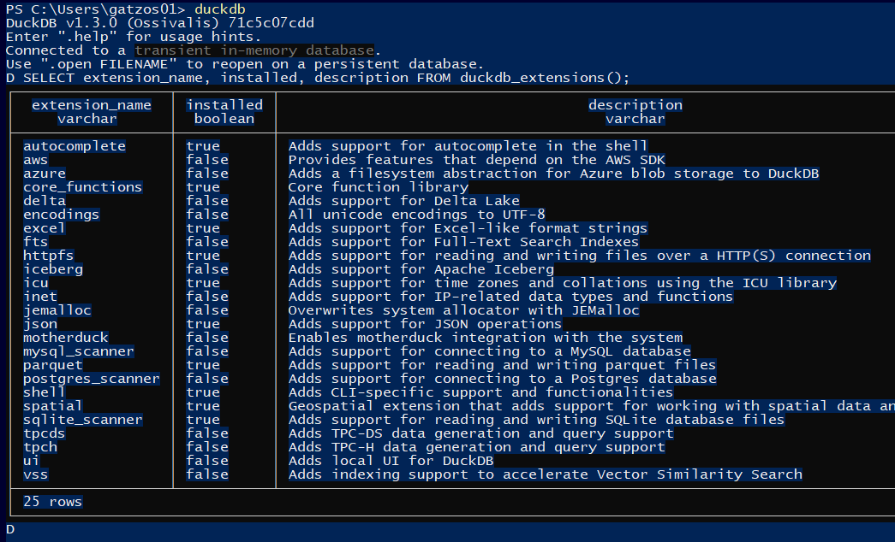
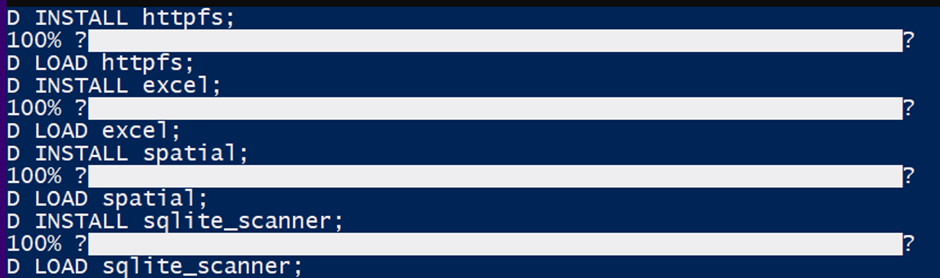
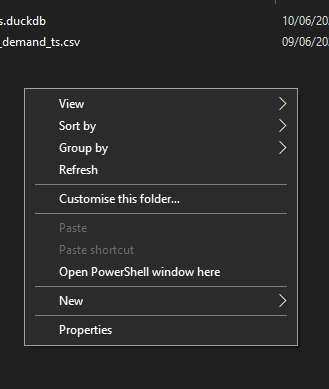
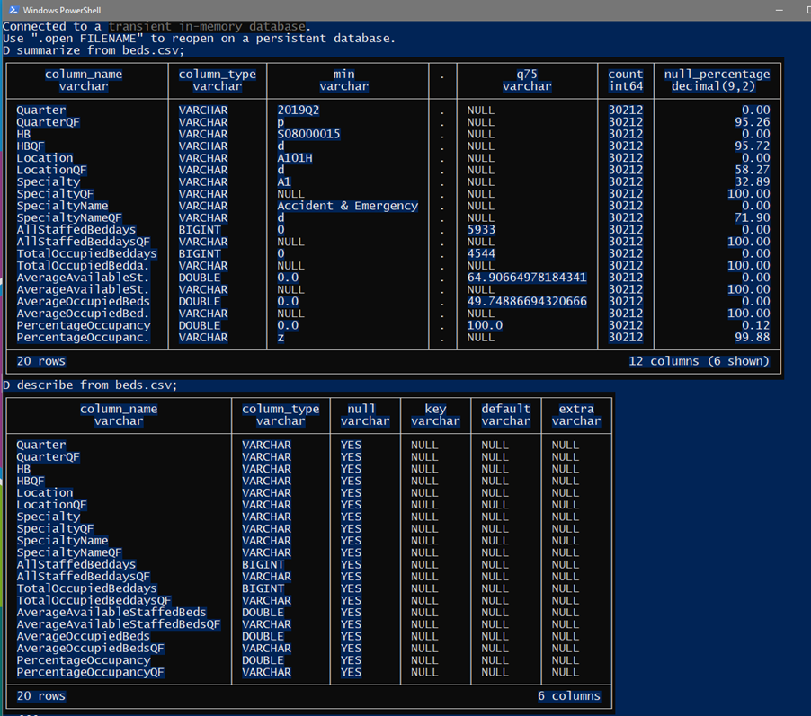
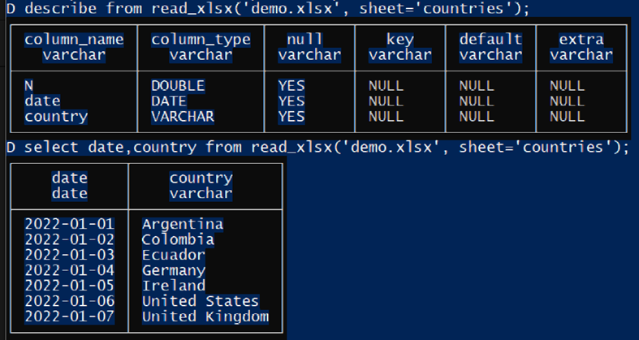
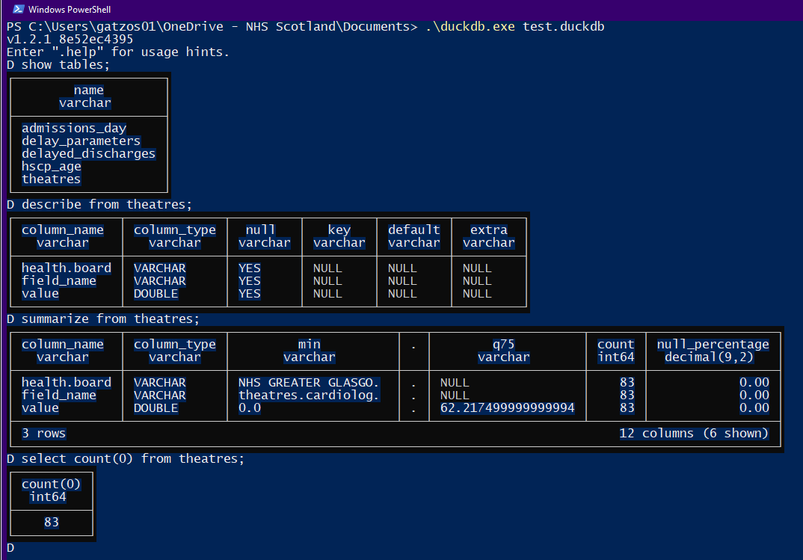
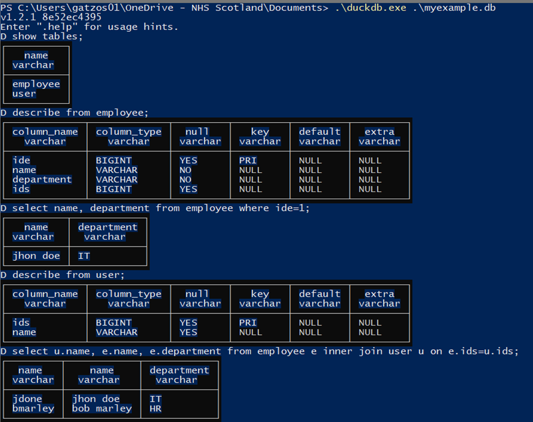
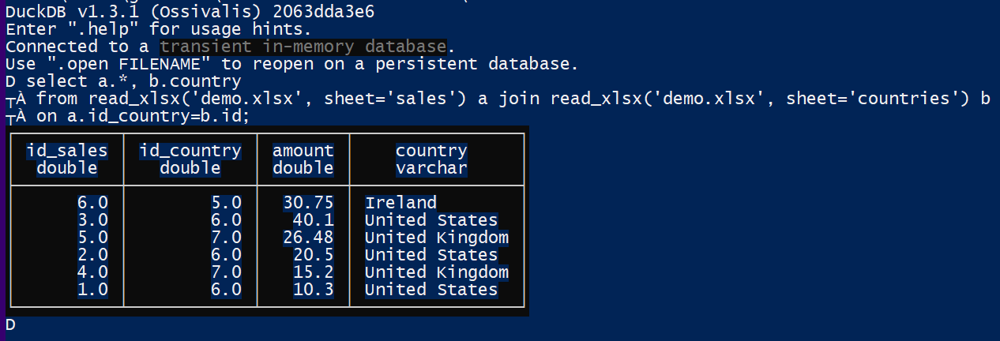
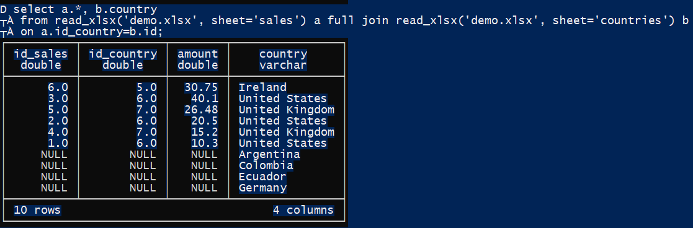
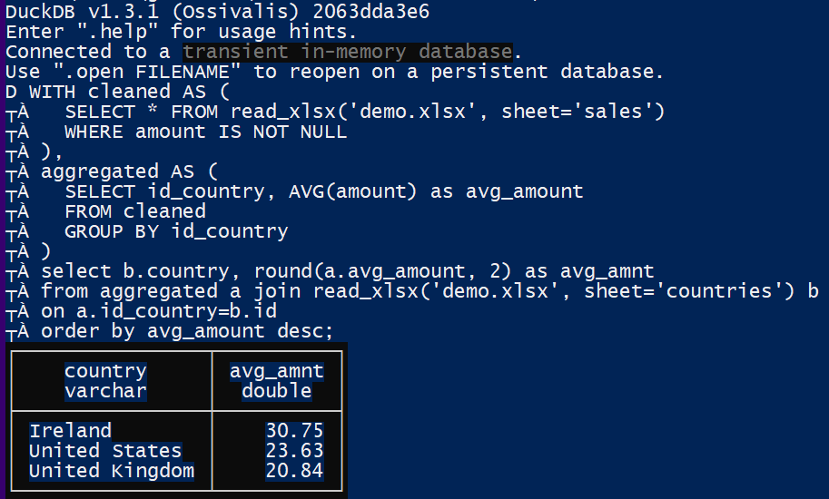

# duckdb_guide
DuckDB is an in-process SQL OLAP database management system. Simple, feature-rich, fast & open source. The current version is 1.4.2 (Nov 2025). If you only want to code in R you have to check R_samples folder.

## Windows installation
- You will have a powerfull tool in your CMD/powershell. No need to run R or Python.
- We will use winget which is an official Microsoft tool (Windows Package Manager). It is **safe** since It pulls packages from the Microsoft Community Package Manifest Repository, which has a review process to ensure packages are safe and legitimate.
- Open a cmd or Powershell (windows) and run the following command: `winget install DuckDB.cli`
- If you already have DuckDb and you want to upgrade to the newest version run this command: `winget upgrade --id DuckDB.cli`
- Then, you can start using duckdb, you need to run the command in a cmd/porwershell: `duckdb`
- You can use the following command to check your installed extension: `SELECT extension_name, installed, description FROM duckdb_extensions();`

- You can exit duckdb using .exit or simply closing the window

### Extensions
- If you only read csv files, it is not mandatory to install the other extensions. So, you can skip these extensions installation.
- The httpfs extension allows you to read and write remote files over HTTP(S) and S3
```
INSTALL httpfs;
LOAD httpfs;
```
- The excel extension enables you to read and write Excel (.xlsx) files
```
INSTALL excel;
LOAD excel;
```
- The spatial extension provides support for geospatial data processing
```
INSTALL spatial;
LOAD spatial;
```
- The sqlite_scanner extension allows DuckDB to directly read and write data from SQLite database file
```
INSTALL sqlite_scanner;
LOAD sqlite_scanner;
```

- If you cannot install the extensions, it may be your firewall/VPN permissions.

### How to use duckdb
- If you already executed duckdb in your PowerShell you won't need to do it again.
- If you want to read files from your network and you don't want to deal with absolute/relative long paths. You can use this Windows workaround. Open your file explorer, go to your network folder, keep pressed shift key and right click in an empty space. You will see **Open PowerShell window here**

- You can write SQL in multiline way. Press enter for multiple lines. A colon (;) means the end of a query.
- There are 2 very useful commands to check datasets. They are “describe” and “summarize”. In this example, I am using beds.csv
`describe from file_name.csv`
`summarize from file_name.csv`

- It’s time to read an excel file using the function read_xlsx('file_name.xlsx', sheet='sheet_name')

- If you have a parquet file, it is simple as a csv file
- If you have a duckdb.file you can easily start duckdb with the name of the file.

- If you already started duckdb with no duck file. You can run "attach" and "use" commands

- It is the same process if you want to work with a sqlite file:

- If you want to export one table from a duckdb or sqlite database, you can use the command COPY
`COPY table_name to ‘file_name.csv’ (format ‘csv’);`
`COPY table_name to ‘file_name.parquet’ (format ‘parquet’);`
`COPY (select field_name, mean(value) as mean_value from admissions_day group by field_name) to ‘grouped_field_mean.csv’ (format ‘csv’);`

## intermediate SQL commands
- You can join 2 tables (same file or different files and formats)
```
select a.*, b.country
from read_xlsx('demo.xlsx', sheet='sales') a left join read_xlsx('demo.xlsx', sheet='countries') b
on a.id_country=b.id;
```


```
select a.*, b.country
from read_xlsx('demo.xlsx', sheet='sales') a full join read_xlsx('demo.xlsx', sheet='countries') b
on a.id_country=b.id;
```


- You can have multiple subqueries like this:
```
WITH cleaned AS (
  SELECT * FROM read_xlsx('demo.xlsx', sheet='sales')
  WHERE amount IS NOT NULL
),
aggregated AS (
  SELECT id_country, AVG(amount) as avg_amount
  FROM cleaned
  GROUP BY id_country
)
select b.country, round(a.avg_amount, 2) as avg_amnt
from aggregated a join read_xlsx('demo.xlsx', sheet='countries') b
on a.id_country=b.id
order by avg_amount desc;
```


## Advance SQL commands
- Regular expressions for column names using columns function
`select HB, columns('Average.*') from beds.csv;`
- We can create the pivot of a table
`PIVOT beds.csv ON Quarter USING MEAN(PercentageOccupancy) GROUP BY HB;`
- It is possible to do the unpivot too
`UNPIVOT pivoted.csv ON COLUMNS(* EXCLUDE HB) INTO NAME Quarter VALUE sales;`

## Resources

- [R functions and DuckDB performance](https://gsandrof66.github.io/Rperformance/Basic_perf.html)
